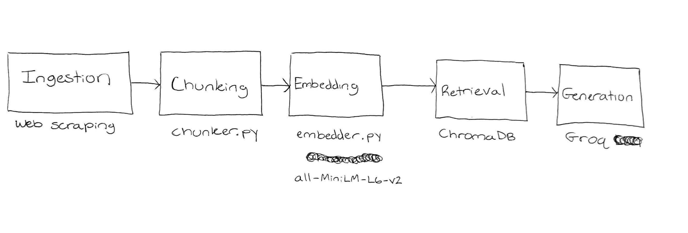

# Project 1 Planning: The Unofficial Guide

> Write this document before you write any pipeline code.
> Your spec and architecture diagram are what you'll use to direct AI tools (Claude, Copilot, etc.) to generate your implementation — the more specific they are, the more useful the generated code will be.
> Update the Retrieval Approach and Chunking Strategy sections if you change your approach during implementation.
> Update this file before starting any stretch features.

---

## Domain

<!-- What domain did you choose? Why is this knowledge valuable and hard to find through official channels? -->

This domain provides a mix of objective information through sports scores, course offerings, and university scheduling but also provides subjective context 
for the information through forum pages. One could use the official course catalog to find which course they need to fulfil a degree plan, but the other sources can narrow down a wide range of choices into preferable outcomes. Official pages are often deep and take time to navigate, which can be inconvenient for someone trying to take a cursory look. 

---

## Documents

<!-- List your specific sources: URLs, subreddit names, forum threads, or file descriptions.
     Aim for at least 10 sources that together cover different subtopics or perspectives within your domain. -->

| # | Source | Description | URL or location |
|---|--------|-------------|-----------------|
| 1 | RateMyProfessor | Texas A&M Computer Science Department | https://www.ratemyprofessors.com/search/professors/1003?q=*&did=11 |
| 2 | TexAgs | News site for A&M football | https://texags.com/aggie-football |
| 3 | r/aggies | Subreddit for Texas A&M | | https://www.reddit.com/r/aggies/ |
| 4 | TAMU Registrar | Summer Academic Calendar | academic-calendar.txt |
| 5 | The Battalion | Student newspaper for campus news | https://www.thebatt.com/news |
| 6 | TAMU Course Catalog | Offician BS - Computer Science Degree Plan | BS-Computer Science.pdf |
| 7 | 12thman | TAMU Athletics news source | https://12thman.com/ |
| 8 | TAMU Transportation | Official FAQs page for university parking and transportation | parking-faqs.txt |
| 9 | TAMU.edu | Upcoming Tuition Due Dates | tuition-due-dates.txt |
| 10 | Visit College Station Events | City page about events within College Station | cstx-events.txt |

---

## Chunking Strategy

<!-- How will you split documents into chunks?
     State your chunk size (in tokens or characters), overlap size, and explain why those
     numbers fit the structure of your documents.
     A review-heavy corpus warrants different chunking than a long FAQ. -->

**Chunk size:**

Documents will the chunked differently based on two schemes. For reviews and focused descriptions, the chunker will take the entire document.
For all other sources, the chunk size will be 200 tokens.

- changes: Single chunking strategy with 150 tokens and 30 overlap. Single chunking strategy allows for simpler implementation and keeping the tokens
lower increases likelihood of chunks remaining within an appropriate size

**Overlap:**

The self contained review sources will have 0 overlap and the other sources will have an overlap of 30 tokens.

- changes: single chunking strategy

**Reasoning:**

It is important that the reviews are taken as they are individually because it is very likely they will have a mixed output. One RateMyProfessor review saying a professor is the best and super easy taken in the same chunk as one contradicting it may cause unwanted results. Also in taking the course catalog information on its own, it will not confuse the content of two courses. Having the larger chunk size for the other sources can take about a paragraph of writing from a news article while keeping some context from adjacent paragraphs.

---

## Retrieval Approach

<!-- Which embedding model are you using (e.g., all-MiniLM-L6-v2 via sentence-transformers)?
     How many chunks will you retrieve per query (top-k)?
     If you were deploying this for real users and cost wasn't a constraint, what tradeoffs
     would you weigh in choosing a different embedding model — context length, multilingual
     support, accuracy on domain-specific text, latency? -->

**Embedding model:**

The embedding model I am using is the all-MiniLM-l6-v2 model.

**Top-k:**

Again, I will be using a dynamic top-k to reflect the source being read. Smaller sources like the course catalog and professor reviews will
take 3 chunks while larger sources will take 5 in order to get the proper context.

**Production tradeoff reflection:**

For real work deployment, different embedding models allow for different functionality. Other models allow for larger chunk sizes to be taken which can be useful for larger articles. I could also consider using a model that is trained on the more business-like language that will be found in the official univerity
pages. Multilingual support is also a strong consideration for using a different model due to the many international students that may be more comfortable using their native language.

---

## Evaluation Plan

<!-- List your 5 test questions with their expected correct answers.
     Questions should be specific enough that you can judge whether the system's response
     is right or wrong. "What are good dining halls?" is too vague.
     "What do students say about wait times at [dining hall name] during lunch?" is testable. -->

| # | Question | Expected answer |
|---|----------|-----------------|
| 1 | What is Professor Paul Taele rated on RateMyProfessor? | 4.6 |
| 2 | What classes should be taken the first semester for a computer science degree? | CHEM 107 and 117, ENGL 103, ENGR 102, MATH 151 |
| 3 | When is tuition due for Summer 2026? | May 21st, 2026 |
| 4 | When is the Caneck Culinary camp? | Jun 8th to Jul 24th |
| 5 | Why are warnings not given to parking violators? | Warnings do not work|

---

## Anticipated Challenges

<!-- What could go wrong? Name at least two specific risks with reasoning.
     Consider: noisy or inconsistent documents, missing source attribution, off-topic
     retrieval, chunks that split key information across boundaries. -->

1. Could mix previous or incorrect information with factual information. University specific questions about certain policies may have changed or a user could be incorrect which could override the correct answer from an official source. 

2. Forum type answers may give conflicting answers that will confuse the model. If someone asks if a professor is good and the chunk receives two comments that say the opposite thing, the model may not give a quality answer.

---

## Architecture

<!-- Draw a diagram of your pipeline showing the five stages:
     Document Ingestion → Chunking → Embedding + Vector Store → Retrieval → Generation
     Label each stage with the tool or library you're using.
     You can use ASCII art, a Mermaid diagram, or embed a sketch as an image.
     You'll use this diagram as context when prompting AI tools to implement each stage. -->

---

## AI Tool Plan

<!-- For each part of the pipeline below, describe:
     - Which AI tool you plan to use (Claude, Copilot, ChatGPT, etc.)
     - What you'll give it as input (which sections of this planning.md, which requirements)
     - What you expect it to produce
     - How you'll verify the output matches your spec

     "I'll use AI to help me code" is not a plan.
     "I'll give Claude my Chunking Strategy section and ask it to implement chunk_text()
     with my specified chunk size and overlap" is a plan. -->

     I will be using Claude with the credits given for this course for every section. I will also ask it to help me organize my project so that
     my personal workflow is optimized and focused.

     Ingestion: Here I will ask AI to help me develop a web scraping tool to access my documents. I will ask again for more specific help retrieving 
     JavaScript information from RateMyProfessor. I will expect basic web scraping scripts that I can run and test locally through console output.

     Chunking: I will use AI to develop two chunking strategies depending on the source with different top-k levels. I will expect it to give me different classes for my sources so that they can conditionally follow different chunking strategies. 

     Embedding: Here I will ask AI to help implement the all-MiniLM-L6-v2 model and integrate it with the previous chunker and web scrapers. I can test this stage by asking AI to make a small script to check that vectors are being produced and stored correctly. 

     Retrieval: Here I will ask AI to help integrate previous steps and ChromaDB and then I will test the retrieved data and ensure that what is being pulled is actually relevant to my previously defined test queries.  

     Generation: Again, I will use AI to help integrate Groq and then make sure my test queries are working correctly. 

**Milestone 3 — Ingestion and chunking:**

**Milestone 4 — Embedding and retrieval:**

**Milestone 5 — Generation and interface:**
